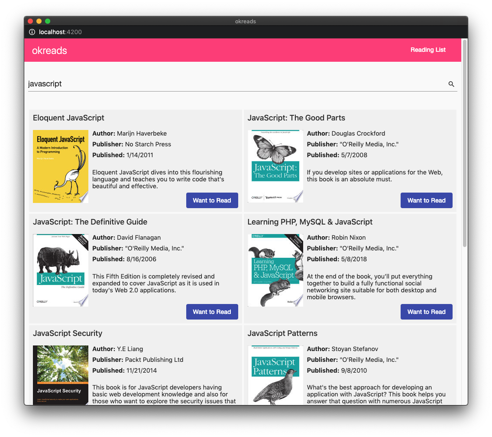
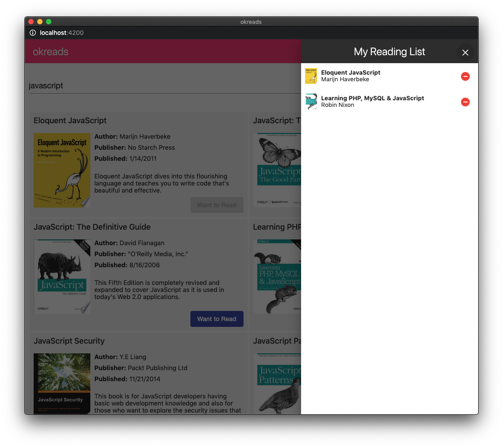

# T-Mobile Dev Puzzle

This dev puzzle tests skills that will be required to contribute to the tos-apps monorepo. It should take around 8 hours to complete [all the tasks](#tasks).

Once you have completed all the tasks, [submit](#submission) your solution to your T-Mobile manager.

## Getting Started

Please **DO NOT** clone or fork this repo. Follow the steps below to get started.

1. [Download the ZIP](../../archive/master.zip) file and extract it on your machine.
2. Go into the extracted folder and run:
   ```
   git init
   git add .
   git commit -m 'initial commit'
   ```
3. Create a _new_ repo on [GitHub](https://github.com)/[GitLab](https://gitlab.com)/[BitBucket](https://bitbucket.org) and push your new repo there.
4. Install dependencies with `npm install`.

You should be able to start the app with `npm start`. The app runs at http://localhost:4200.

### About this app

The app you will be working on is called _okreads_. This app allows you to search for books and add them to your reading list. It is like [goodreads](https://goodreads.com) but lighter on features.

Users can search for books.



Then add them to their reading list.



#### Technologies used

- [Angular](http://angular.io/) - Browser app
- [NgRx](https://ngrx.io/) - State management
- [NestJS](https://docs.nestjs.com/) - API app
- [Nx](https://nx.dev/) - CLI dev tools

### Helpful Hints

- You can see an overview of the architecture by running `npx nx dep-graph`.
- You should not need to modify anything in the `apps/okreads` folder. The `browser` and `api` apps are shells that wrap around projects in the `libs` folder.
- Make sure lint and tests are passing before submitting your code. Write new tests as necessary.
- You can run individual tests by providing the project name as found in `angular.json`. For example,
  ```
  npx nx test books-data-access
  npx nx test books-feature
  ```

## Tasks

There are five tasks in total. Each task has an estimated time for completion, so use this as a rough guide.

### Task 1: Code fixes and review

**Estimated time:** 1 hour

1. Starting from the `master` branch, create a new branch `chore/code-review`.
2. Create a file named `CODE_REVIEW.md` at the workspace root write a short code review based on the existing code.

   For example,

   - Are there any problems or code smells in the app? (Focus on code in the `libs/books` folder)
   - Are there other improvements you would make to the app? What are they and why?

   Write your review in bullet points. You should list at least three items.

3. [Accessibility](https://webaim.org/intro/) is an important feature of all public facing websites.

   - In Google Chrome, run an automated scan with the Lighthouse extension. [Lighthouse](https://chrome.google.com/webstore/detail/lighthouse/blipmdconlkpinefehnmjammfjpmpbjk), note these issues.
   - In Chrome again, manually check for accessibility issues. Identify at least 3 issue, not found in the automated scan.

4. Fix _at least one_ of the issues noted in step 2 and _all_ the issues from step 3.
5. Run lint, unit tests, and e2e tests. Fix anything that fails.

   ```
   npm run lint
   npm run test
   npm run e2e
   ```

   **Note:** For the e2e tests to work the app must be running (`npm start`).

6. Commit your changes to the feature branch and open a pull-request with `master` as the target.

**Note:** You should now have two commits on `master`. For example, you should see something similar to the following in git.

```
$ git log --oneline
bbbbbbb (HEAD -> master) chore: add code review and fix tests
aaaaaaa initial commit
```

### Task 2: Adding instant search

**Estimated time:** 1 hour

**Requirements**

> As a user, I want to see book results as I am typing in the search field -- I don't want to have to submit the form.

1. Starting from the `chore/code-review` branch from Task 1, create a new branch `feat/instant-search`.
2. Update the code to provide instant search results as the user is typing. Be sure not to spam the API with too many calls -- no more than one request every 500 ms.
3. Open the e2e test file `apps/okreads-e2e/src/specs/search-books.spec.ts`. Enable the second spec by renaming `xit` to `it`, then implement the test to ensure instant search works.
4. Commit your changes to the feature branch and open a pull-request with `chore/code-review` as the target.

### Task 3: Undo add and remove from reading list

**Estimated time:** 2-4 hours

**Requirements**

> As a user, I want to be able to quickly undo my action when clicking the `Want to Read` button in the book list, or the remove button in the reading list.

1. Starting from the `chore/code-review` branch from Task 1, create a new branch `feat/undo-actions`.
2. Update the code such that a [snackbar](https://material.angular.io/components/snack-bar/overview) appears whenever the user adds or removes a book. (Hint: this module is already installed and set up)
   - The snackbar must display the event that occurred (i.e. added/removed), and an `Undo` action.
   - When the user clicks `Undo` it should set the reading list state back to the previous state.
3. Write a new e2e test in `apps/okreads-e2e/src/specs/reading-list.spec.ts` to test the new undo feature.
4. Commit your changes on the feature branch and open a pull-request with `chore/code-review` as the target.

### Task 4: Ability to mark a book as finished

**Estimated time:** 2-4 hours

**Requirements**

> As a user, I want to be able to mark a book as finished in my reading list.

1. Starting from the `chore/code-review` branch from Task 1, create a new branch `feat/mark-as-read`.
2. Update the _api_ code to provide a new `PUT /api/reading-list/:id/finished` endpoint.
   - This endpoint should update the `finished` flag to `true` and set `finishedDate` as an ISO date string (e.g. `2020-01-01T00:00:00.000Z`).
3. Update the UI to allow user to mark a book as _finished_ from the reading list sidenav. (Bonus points for a thoughtful UI/UX design for this feature)
   - Indicate the book as finished in the sidenav, including the finished date.
   - The user can still remove the book from their reading list. Removing a book will reset the finished status (i.e. if they add the book back it will not be finished).
   - The `Want to Read` button should change to `Finished`.
4. Write a new e2e test in `apps/okreads-e2e/src/specs/reading-list.spec.ts` to test the new mark as finished feature.
5. Commit your changes on the feature branch and open a pull-request with `chore/code-review` as the target.

## Submission

Ready to submit? Please review the checklist below.

1. Have you opened four pull-requests for the tasks? Make sure they are opened with the correct target branch.
   - Task 1: `chore/code-review -> master`
   - Task 2: `feat/instant-search -> chore/code-review`
   - Task 3: `feat/undo-actions -> chore/code-review`
   - Task 4: `feat/mark-as-read -> chore/code-review`
2. Are all your features working as per requirements?
3. Are lint, test, e2e passing?

Once you are done, send the link to your repo to your T-Mobile manager for evaluation.
